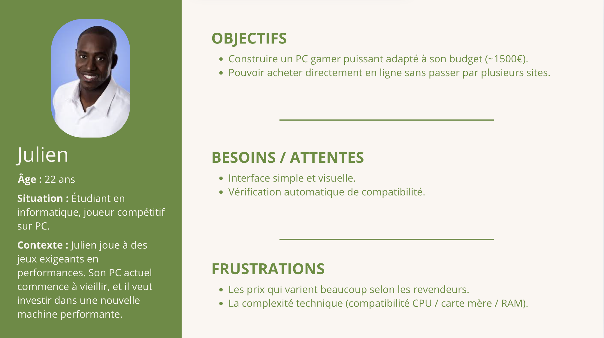
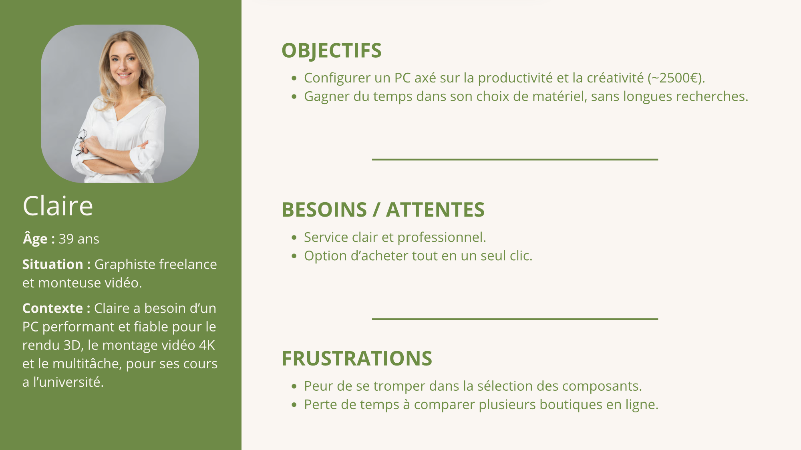
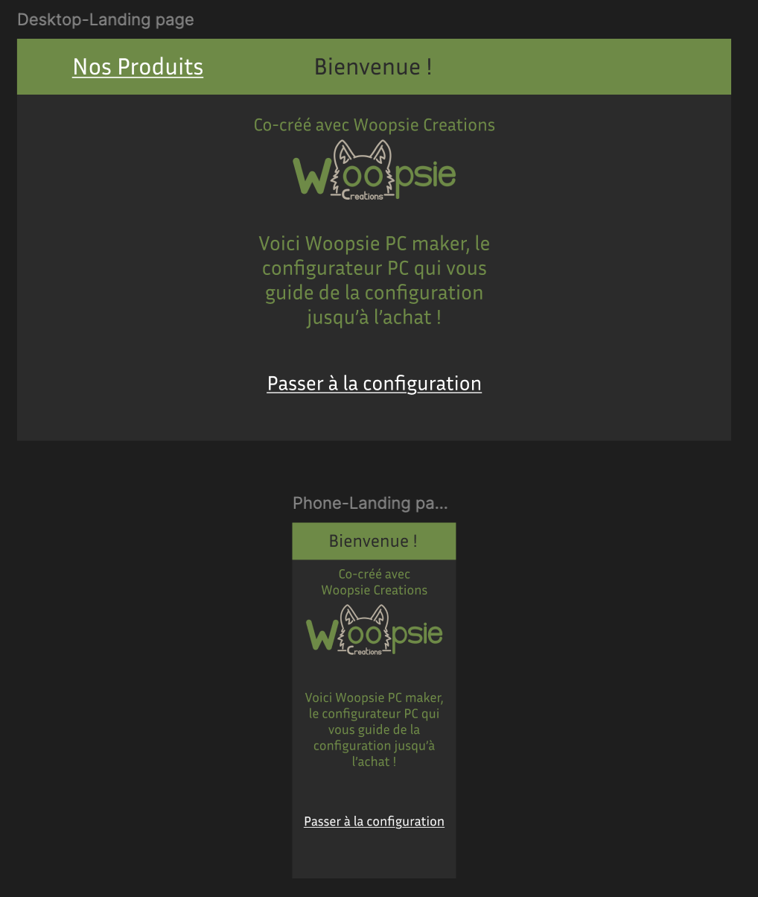
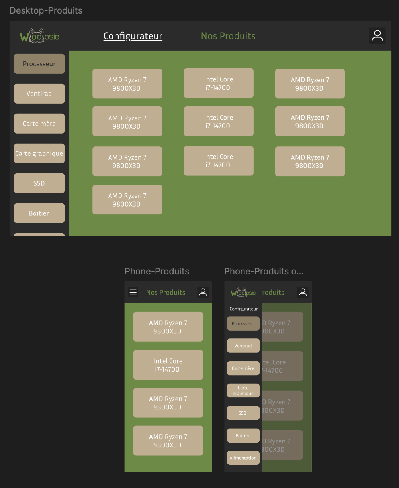
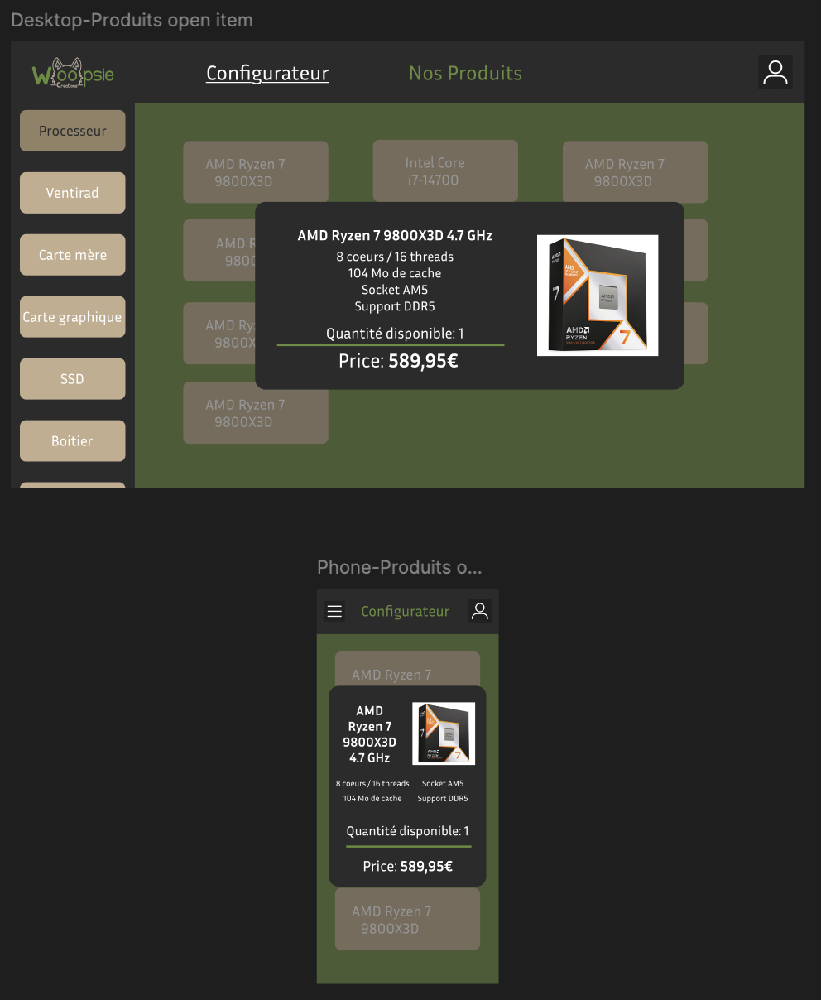
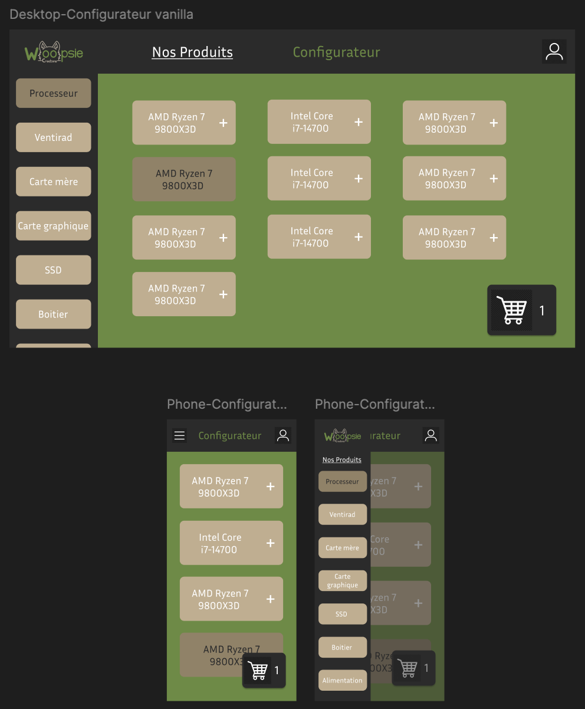
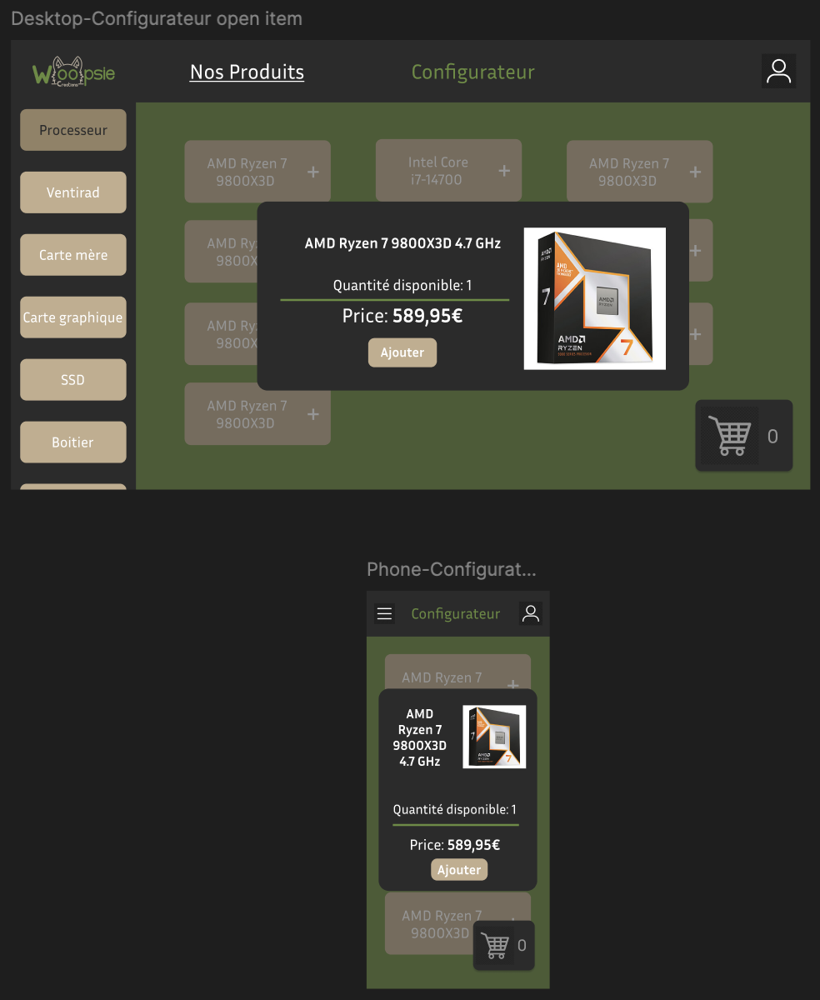
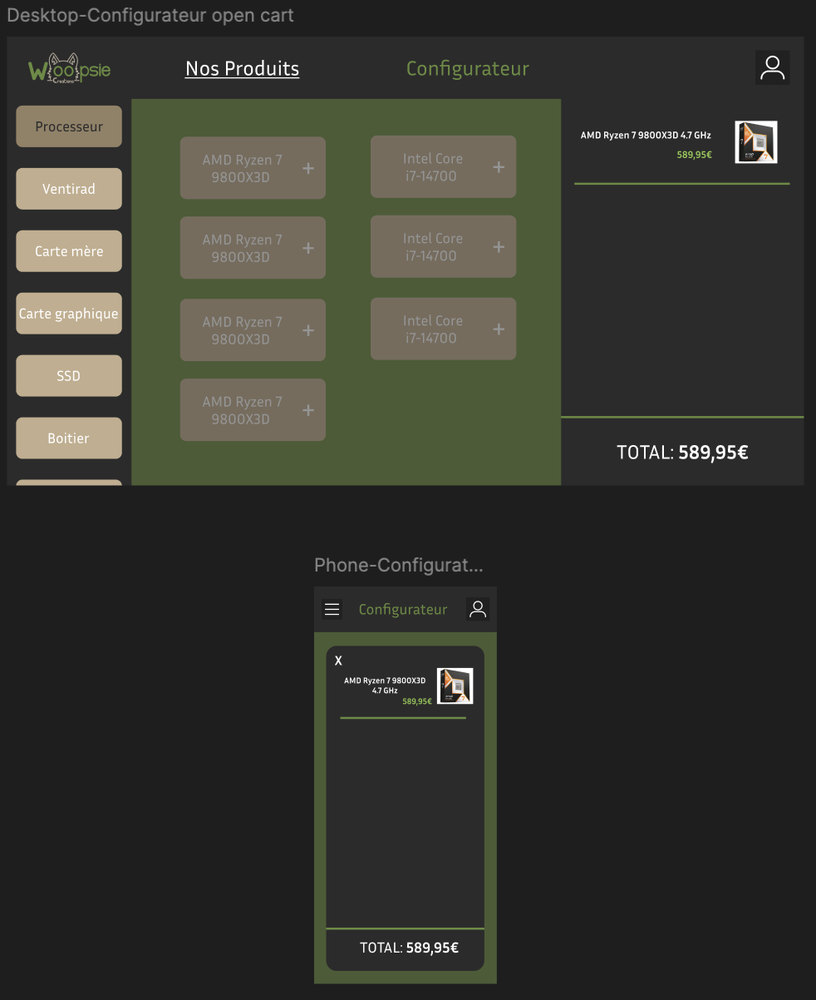

# Woopsie PC Maker

## Spécifications fonctionnelles

### Définition Du Projet

Le projet **Woopsie PC Maker** est une plateforme web, permettant aux utilisateurs de **configurer leur PC** sur mesure. Le site offre un configurateur interactif où l’on peut **sélectionner chaque composant**, vérifier la **compatibilité**, puis ajouter les pièces choisies dans un **panier intégré**. Une fois la configuration validée, l’utilisateur peut **finaliser son achat** directement via la plateforme, simplifiant ainsi l’expérience d’assemblage et d’acquisition d’un ordinateur personnalisé tout en augmentant la visibilité des composants.

Le projet est co-dirigé par **Woopsie Creations**.

### Personas

Le public cible est défini avec ces **utilisateurs types**:

#### Julien, Le Gamer Passionné

#### Claire, La Professionnelle Créative

#### Fonctionnalités Principales

1. **Sélection des Composants :**
   - Les utilisateurs pourront parcourir et sélectionner des composants dans un catalogue.
   - Chaque composant affichera des spécifications détaillées, les prix et la disponibilité.

2. **Vérificateur de Compatibilité :**
   - La plateforme vérifiera automatiquement la compatibilité des composants sélectionnés (par exemple, proposer uniquement des cartes mère avec des types sockets compatibles au CPU choisit).

3. **Tarification en Temps Réel :**
   - Le prix total de la configuration sera mis à jour dynamiquement à mesure que des composants sont ajoutés ou supprimés.

4. **Panier Intégré :**
   - Les composants sélectionnés seront automatiquement ajoutés à un panier pour les examiner avant l'achat.

5. **Comptes Utilisateurs :**
   - Les utilisateurs pourront créer des comptes pour sauvegarder leurs configurations, suivre leurs commandes et gérer leurs profils.

#### Améliorations Futures

- Design **responsive**, garantissant une utilisation optimale sur ordinateurs, tablettes et appareils mobiles.
- Formulaire au début de la configuration pour connaître les objectifs de l'utilisateur, et orienter ainsi les produits les plus adaptés.

#### Types De Composants

Voici une liste des types/catégories de composants proposés sur le site:

- Processeur
- Ventirad et AIO
- Carte mère
- Mémoire vive
- Carte graphique
- SSD
- Disque dur
- Boitier
- Alimentation
- Carte son
- Carte réseau

#### Pages Du Projet

Le projet est structuré autour de **plusieurs pages principales**, chacune ayant un rôle spécifique dans l'expérience utilisateur. Voici les pages et leurs relations :

1. **Page d'Accueil :**
   - Présente un aperçu du projet, les avantages de la plateforme, et un bouton pour commencer la configuration.
   - Contient des liens vers les autres sections importantes (ex. : À propos, Contact).

2. **Page de Configurateur :**
   - **Drawer à gauche :** Permet de sélectionner le type de composant.
   - **Zone principale :** Affiche dynamiquement les informations des composants correspondant au type sélectionné dans le drawer, sans recharger la page.
   - Inclut un résumé en temps réel de la configuration actuelle (prix total, compatibilité, etc.).

3. **Page Panier :**
   - Même si le panier peut être afficher en temps réel pendant la configuration, une page est dédiée pour la finalisation de la commande.
   - Affiche les composants sélectionnés avec leurs détails (nom, prix).
   - Permet de modifier ou supprimer des composants avant de passer à l'achat.

4. **Page de Paiement :**
   - Permet de finaliser l'achat avec des options de paiement sécurisées.
   - Affiche un récapitulatif de la commande avant validation.

5. **Page Profil Utilisateur :**
   - Accessible après connexion.
   - Permet de gérer les configurations sauvegardées, consulter l'historique des commandes, et modifier les informations personnelles.

#### Interface Utilisateur (UI)

- La plateforme utilisera les **couleurs de marque de Woopsie Creations** :
  - Couleur principale claire : **Vert** (#8DC94B)
  - Couleur principale foncée : **Vert** (#668B3D)
  - Couleur secondaire claire : **Orange grisâtre** (#C2AD8D)
  - Couleur secondaire foncée : (#938165)
  - Couleur de texte : (#FFFFFF)
  - Couleur de texte sélectionné : (#4B4B4B)
  - Couleur de Header/Drawer/Footer : (#4B4B4B)
- Le configurateur proposera une interface **intuitive avec bouton unique** pour sélectionner les composants.

#### Mock-Ups

**Landing Page**

**Page de Produits**

**Page de Configurateur**

